<h1 align="center">codeshot</h1>

<p align="center">
  <b>Turn code into a beautiful image, from your terminal.</b><br>
  One binary. No browser, no server, nothing leaves your machine.
</p>

<p align="center">
  <a href="https://github.com/securekomodo/codeshot/actions/workflows/ci.yml"></a>
  
  
  
  
</p>

<p align="center">
  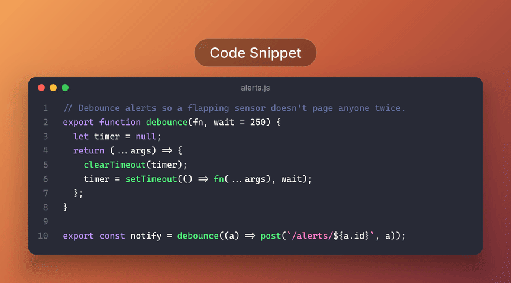
  <br>
  <sub>Every frame was rendered by <code>codeshot</code>: both window styles, thirteen themes, ten backdrops, eight fonts.</sub>
</p>

## Install

Go 1.25 or newer is the only requirement. The fonts and the rasterizer are inside the binary.

```sh
git clone https://github.com/securekomodo/codeshot.git && cd codeshot
go build -o codeshot ./cmd/codeshot
./codeshot main.go        # → main-go.png, ready to paste anywhere
```

Move the binary somewhere on your `PATH` and you are done. Pipe anything in (`git diff | codeshot`), point it at a file, or add `--copy` to skip the file and go straight to the clipboard.

## Good to know

- **Everything happens on your machine.** Highlighting, layout and rendering run inside the binary. There is no network code at all, so nothing you paste can go anywhere.
- **No account, no API key, no telemetry.** Nothing to sign up for and nothing phoning home.
- **One file, nothing else to install.** No browser, no ImageMagick, no system libraries. Works offline on macOS, Linux and Windows.
- **Output is just a file.** A PNG or SVG where you asked for it, or your clipboard. Nothing else is written anywhere.
- **Your terminal sessions and logs are safe to render.** Sample credentials in the built-in demos are placeholders, and your own content never leaves the process.
- **Honest numbers.** About 16 MB on disk (fonts and the rasterizer make up most of it) and about a second per image.

<br>

<p align="center"><sub>Everything below is the catalog: themes, backdrops, fonts, presets, recipes, and every flag.</sub></p>

<p align="center">
  <a href="#pick-a-theme">Themes</a> ·
  <a href="#pick-a-backdrop">Backdrops</a> ·
  <a href="#pick-a-window">Windows</a> ·
  <a href="#pick-a-font">Fonts</a> ·
  <a href="#presets-for-the-things-developers-actually-screenshot">Presets</a> ·
  <a href="#recipes">Recipes</a> ·
  <a href="#how-it-works">How it works</a> ·
  <a href="#license">License</a> ·
  <a href="#credits">Credits</a>
</p>

## Pick a theme

<table align="center"><tr>
<td align="center" valign="top"><a href="docs/themes/dracula.png">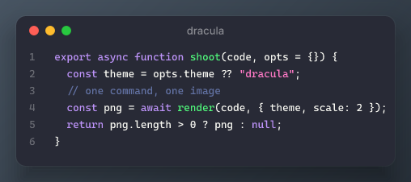</a><br><sub><code>--theme dracula</code></sub></td>
<td align="center" valign="top"><a href="docs/themes/nightOwl.png">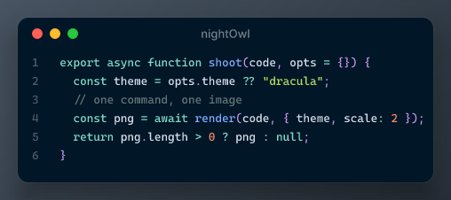</a><br><sub><code>--theme nightOwl</code></sub></td>
<td align="center" valign="top"><a href="docs/themes/oneDark.png">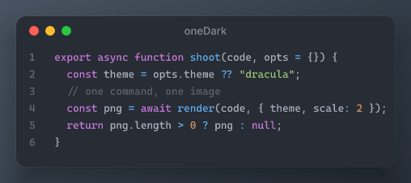</a><br><sub><code>--theme oneDark</code></sub></td>
<td align="center" valign="top"><a href="docs/themes/palenight.png">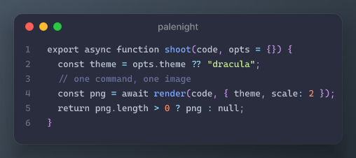</a><br><sub><code>--theme palenight</code></sub></td>
</tr><tr>
<td align="center" valign="top"><a href="docs/themes/oceanicNext.png">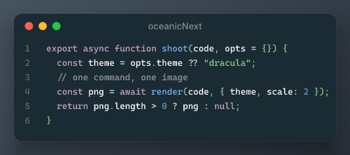</a><br><sub><code>--theme oceanicNext</code></sub></td>
<td align="center" valign="top"><a href="docs/themes/shadesOfPurple.png">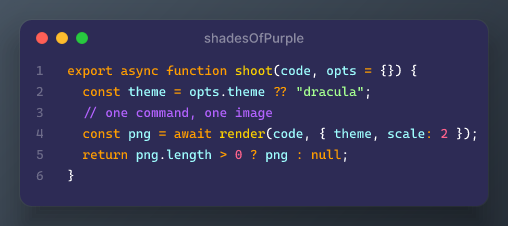</a><br><sub><code>--theme shadesOfPurple</code></sub></td>
<td align="center" valign="top"><a href="docs/themes/vsDark.png">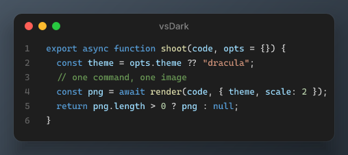</a><br><sub><code>--theme vsDark</code></sub></td>
<td align="center" valign="top"><a href="docs/themes/okaidia.png">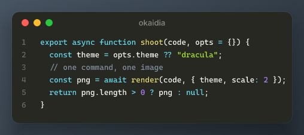</a><br><sub><code>--theme okaidia</code></sub></td>
</tr><tr>
<td align="center" valign="top"><a href="docs/themes/gruvboxDark.png">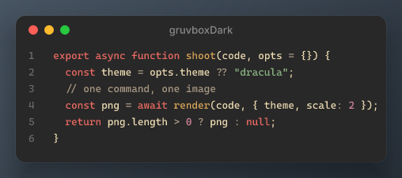</a><br><sub><code>--theme gruvboxDark</code></sub></td>
<td align="center" valign="top"><a href="docs/themes/github.png">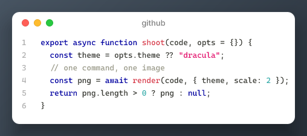</a><br><sub><code>--theme github</code></sub></td>
<td align="center" valign="top"><a href="docs/themes/oneLight.png">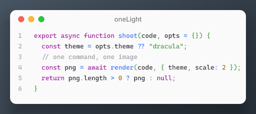</a><br><sub><code>--theme oneLight</code></sub></td>
<td align="center" valign="top"><a href="docs/themes/nightOwlLight.png">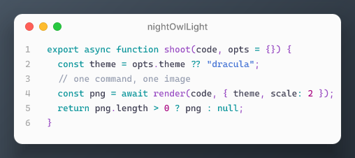</a><br><sub><code>--theme nightOwlLight</code></sub></td>
</tr><tr>
<td align="center" valign="top"><a href="docs/themes/kali.png">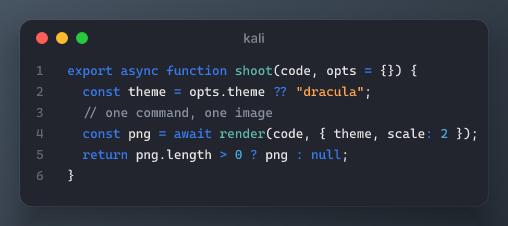</a><br><sub><code>--theme kali</code></sub></td>
</tr></table>

## Pick a backdrop

<table align="center"><tr>
<td align="center" valign="top"><a href="docs/backdrops/ember.png">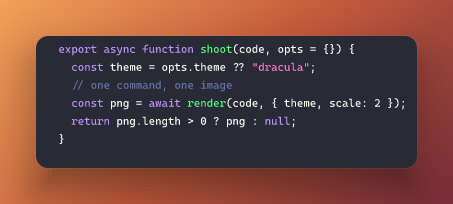</a><br><sub><code>--bg ember</code></sub></td>
<td align="center" valign="top"><a href="docs/backdrops/darkroom.png">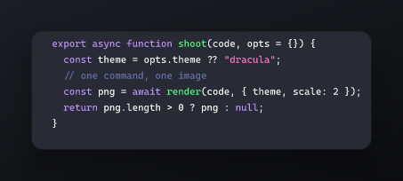</a><br><sub><code>--bg darkroom</code></sub></td>
<td align="center" valign="top"><a href="docs/backdrops/tide.png">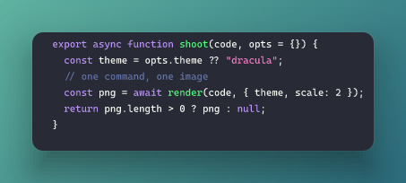</a><br><sub><code>--bg tide</code></sub></td>
<td align="center" valign="top"><a href="docs/backdrops/dusk.png">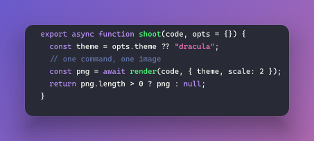</a><br><sub><code>--bg dusk</code></sub></td>
</tr><tr>
<td align="center" valign="top"><a href="docs/backdrops/citrus.png">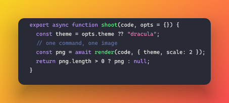</a><br><sub><code>--bg citrus</code></sub></td>
<td align="center" valign="top"><a href="docs/backdrops/slate.png">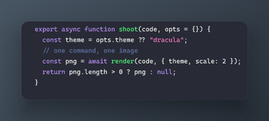</a><br><sub><code>--bg slate</code></sub></td>
<td align="center" valign="top"><a href="docs/backdrops/mint.png">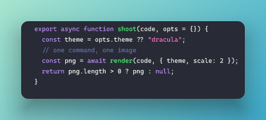</a><br><sub><code>--bg mint</code></sub></td>
<td align="center" valign="top"><a href="docs/backdrops/rose.png">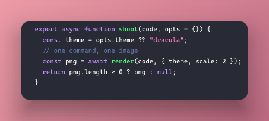</a><br><sub><code>--bg rose</code></sub></td>
</tr><tr>
<td align="center" valign="top"><a href="docs/backdrops/ink.png">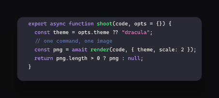</a><br><sub><code>--bg ink</code></sub></td>
<td align="center" valign="top"><a href="docs/backdrops/paper.png">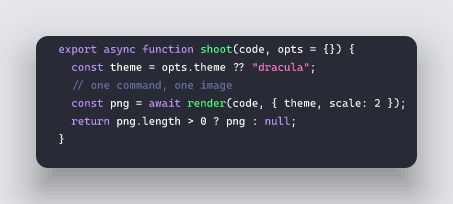</a><br><sub><code>--bg paper</code></sub></td>
<td align="center" valign="top"><a href="docs/backdrops/none.png">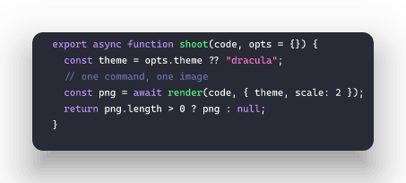</a><br><sub><code>--bg none</code></sub></td>
</tr></table>

## Pick a window

<table align="center"><tr>
<td align="center" valign="top"><a href="docs/window-mac.png">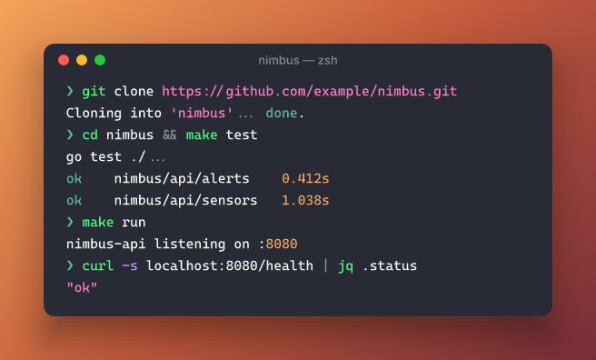</a><br><sub><code>--chrome mac</code> (default)</sub></td>
<td align="center" valign="top"><a href="docs/window-kali.png">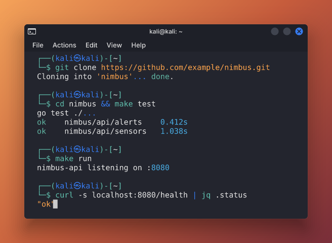</a><br><sub><code>--chrome kali --cursor</code></sub></td>
</tr></table>

The Kali style is the Kali Linux terminal as it ships: the title bar with the terminal icon and the controls on the right, the menu bar, terminal line spacing, Kali's own color scheme (<code>--theme kali</code>) in DejaVu Sans Mono (<code>--font dejavu</code>), and the two-line zsh prompt with the <code>㉿</code>. Plain <code>$</code> prompts and <code>user@host:~$</code> prompts are rewritten into it, a blank line separates commands, and sessions captured on Kali pass through untouched. <code>--prompt root@kali:/root#</code> changes who the prompt shows. The faint sweeping bands in the body are the built-in <code>swirl</code> watermark; <code>--watermark none</code> removes them and <code>--watermark path/to/image.png</code> overlays your own wallpaper or logo instead. Every other theme, backdrop and font still applies on top.

## Or no backdrop at all

<p align="center">
  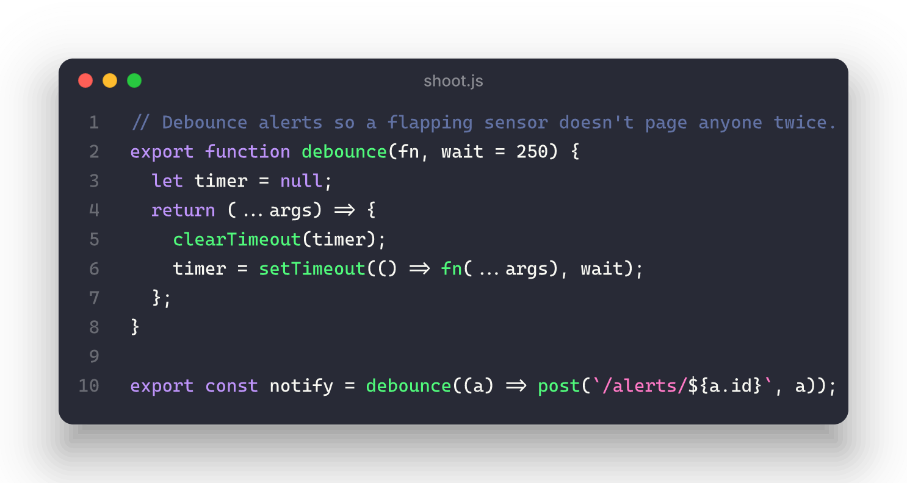
  <br>
  <sub><code>--transparent</code> keeps the window and its soft shadow and drops the color: a PNG with an alpha channel that sits on any page, slide, or chat bubble. This one is sitting on GitHub's own background right now.</sub>
</p>

<p align="center">
  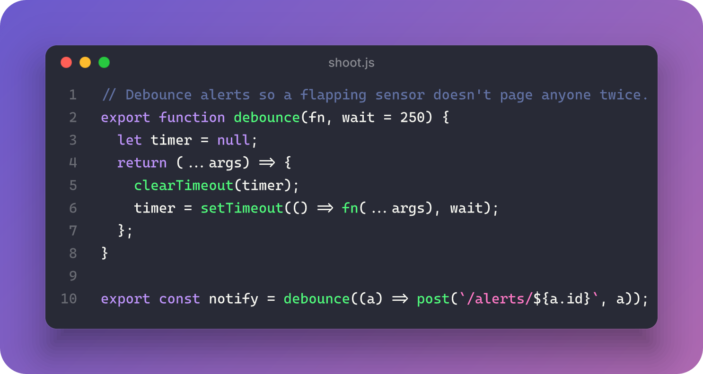
  <br>
  <sub><code>--radius 28</code> rounds the backdrop's corners (they become transparent), and <code>--card-radius</code> changes the window's.</sub>
</p>

## Pick a font

Every face is bundled. Point <code>--font</code> at any <code>.ttf</code> or <code>.otf</code> on disk to use your own.

<table align="center"><tr>
<td align="center" valign="top"><a href="docs/fonts/cascadia.png">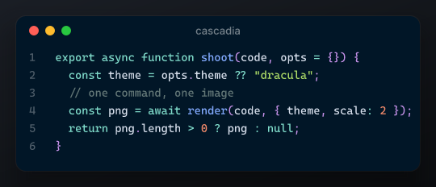</a><br><sub>Cascadia Code · <code>--font cascadia</code></sub></td>
<td align="center" valign="top"><a href="docs/fonts/jetbrains.png"></a><br><sub>JetBrains Mono · <code>--font jetbrains</code></sub></td>
<td align="center" valign="top"><a href="docs/fonts/fira.png">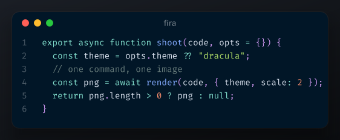</a><br><sub>Fira Code · <code>--font fira</code></sub></td>
<td align="center" valign="top"><a href="docs/fonts/geist.png">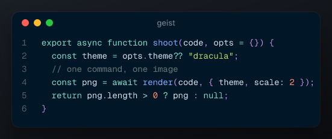</a><br><sub>Geist Mono · <code>--font geist</code></sub></td>
</tr><tr>
<td align="center" valign="top"><a href="docs/fonts/ibm.png">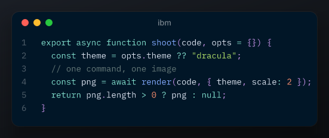</a><br><sub>IBM Plex Mono · <code>--font ibm</code></sub></td>
<td align="center" valign="top"><a href="docs/fonts/source.png">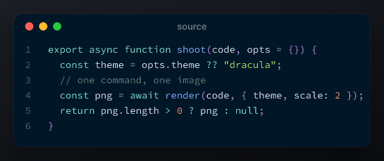</a><br><sub>Source Code Pro · <code>--font source</code></sub></td>
<td align="center" valign="top"><a href="docs/fonts/space.png">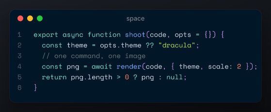</a><br><sub>Space Mono · <code>--font space</code></sub></td>
<td align="center" valign="top"><a href="docs/fonts/dejavu.png"></a><br><sub>DejaVu Sans Mono · <code>--font dejavu</code></sub></td>
</tr></table>

## Presets for the things developers actually screenshot

Each preset sets the render mode, title and language. Add <code>--sample</code> to see it with the built-in snippet, or feed it your own.

<table align="center"><tr>
<td align="center" valign="top"><a href="docs/presets/code.png">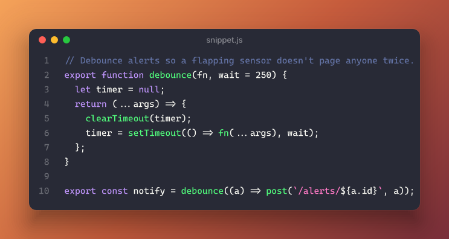</a><br><b>Code</b><br><sub><code>--preset code</code></sub></td>
<td align="center" valign="top"><a href="docs/presets/terminal.png">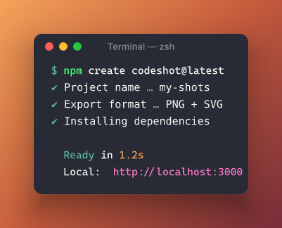</a><br><b>Terminal</b><br><sub><code>--preset terminal</code></sub></td>
<td align="center" valign="top"><a href="docs/presets/api.png">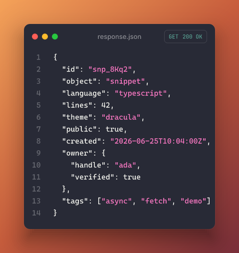</a><br><b>API response</b><br><sub><code>--preset api</code></sub></td>
</tr><tr>
<td align="center" valign="top"><a href="docs/presets/error-log.png">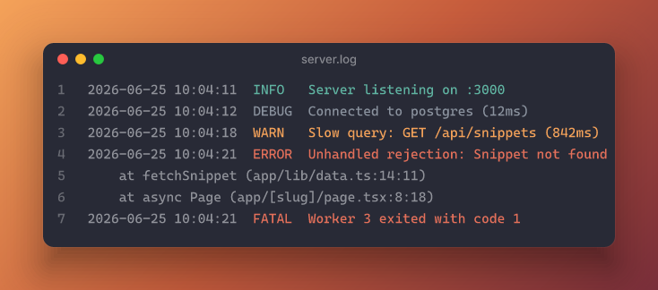</a><br><b>Logs</b><br><sub><code>--preset error-log</code></sub></td>
<td align="center" valign="top"><a href="docs/presets/db-schema.png">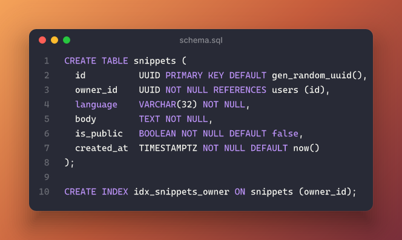</a><br><b>Schema</b><br><sub><code>--preset db-schema</code></sub></td>
<td align="center" valign="top"><a href="docs/presets/sql-query.png">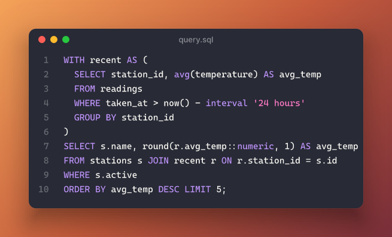</a><br><b>SQL</b><br><sub><code>--preset sql-query</code></sub></td>
</tr><tr>
<td align="center" valign="top"><a href="docs/presets/regex.png">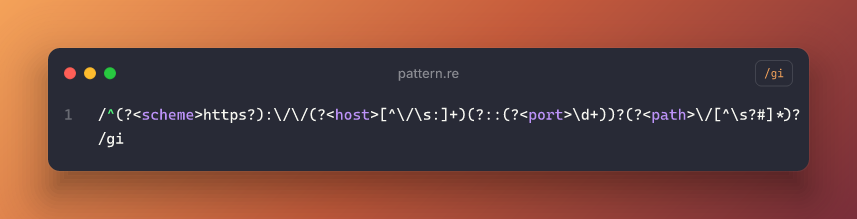</a><br><b>Regex</b><br><sub><code>--preset regex</code></sub></td>
<td align="center" valign="top"><a href="docs/presets/git-commit.png">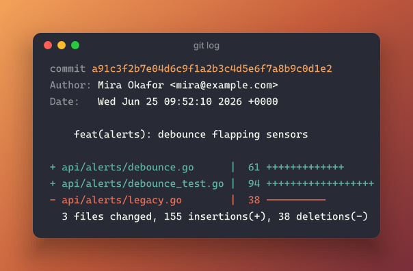</a><br><b>Git log</b><br><sub><code>--preset git-commit</code></sub></td>
<td align="center" valign="top"><a href="docs/presets/project-structure.png">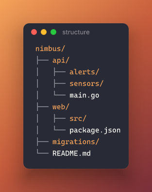</a><br><b>Project tree</b><br><sub><code>--preset project-structure</code></sub></td>
</tr><tr>
<td align="center" valign="top"><a href="docs/presets/env-vars.png">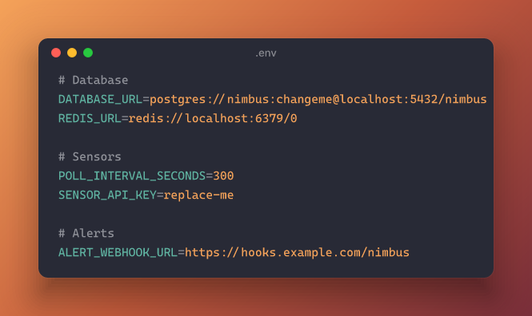</a><br><b>Env file</b><br><sub><code>--preset env-vars</code></sub></td>
<td align="center" valign="top"><a href="docs/presets/terminal-session.png">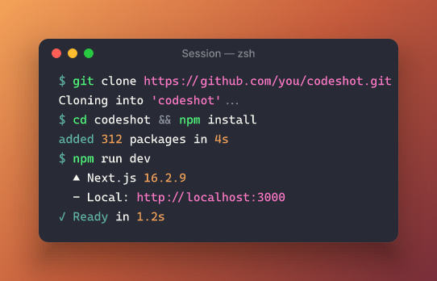</a><br><b>Session</b><br><sub><code>--preset terminal-session</code></sub></td>
<td align="center" valign="top"><a href="docs/presets/dev-milestone.png">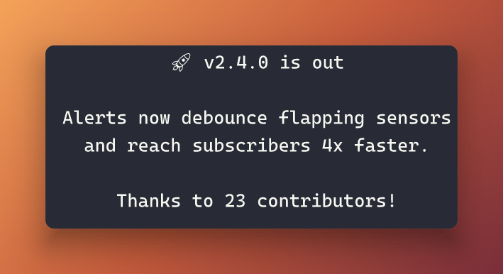</a><br><b>Milestone</b><br><sub><code>--preset dev-milestone</code></sub></td>
</tr><tr>
<td align="center" valign="top"><a href="docs/presets/http-request.png">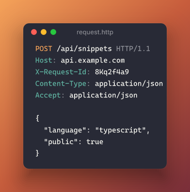</a><br><b>HTTP</b><br><sub><code>--preset http-request</code></sub></td>
<td align="center" valign="top"><a href="docs/presets/git-diff.png">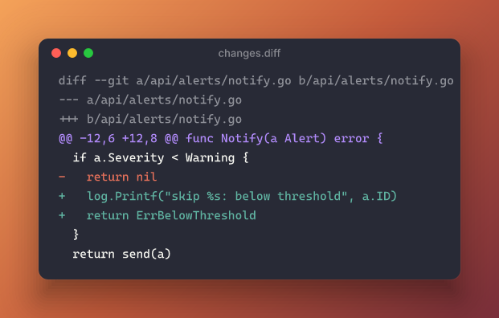</a><br><b>Diff</b><br><sub><code>--preset git-diff</code></sub></td>
<td align="center" valign="top"><a href="docs/presets/test-results.png">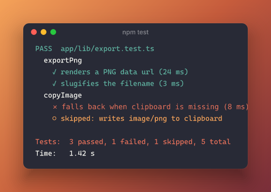</a><br><b>Tests</b><br><sub><code>--preset test-results</code></sub></td>
</tr><tr>
<td align="center" valign="top"><a href="docs/presets/ascii-tree.png"></a><br><b>ASCII tree</b><br><sub><code>--preset ascii-tree</code></sub></td>
<td align="center" valign="top"><a href="docs/presets/perf-metrics.png"></a><br><b>Metrics</b><br><sub><code>--preset perf-metrics</code></sub></td>
</tr></table>

## Recipes

```sh
# Share what you just changed (the diff preset is picked from the content)
git diff | codeshot --title "fix: retry on 429" --copy

# A whole shell session, with commands and output highlighted
script -q /dev/null | tee session.txt; codeshot --preset terminal session.txt

# The same session as a Kali Linux terminal, two-line prompt, cursor waiting on the last line
codeshot --chrome kali --cursor session.txt
codeshot --chrome kali --prompt root@kali:/root# session.txt   # as root
codeshot --chrome kali --watermark ~/Pictures/wallpaper.png session.txt   # your own wallpaper showing through

# The last ten commits, styled
git log -10 | codeshot --title "git log" -o log.png

# Test output from CI, minus the noise
npm test 2>&1 | tail -20 | codeshot --preset test-results --title "npm test"

# A JSON response, pretty and framed
curl -s https://api.example.com/v1/thing | jq . | codeshot --preset api --status 200 --title thing.json

# Your project layout, for the README
tree -L 2 --noreport | codeshot --preset project-structure --bg ink

# Big, centered, no window: an announcement card
echo "🎉 v2.0 is out" | codeshot --preset dev-milestone --bg dusk

# Caption it (this is how the frames of the animation above are labeled)
codeshot --label "Before" old.go && codeshot --label "After" new.go
codeshot --label "Release notes" --label-size 24 changelog.md

# No backdrop: just the window and its shadow, on whatever you paste it into
codeshot --transparent --copy main.go

# Rounded corners on the backdrop, sharper ones on the window
codeshot --radius 24 --card-radius 6 main.go

# Tired of the same orange? Make every shot a surprise
alias shot='codeshot --bg random --copy'
shot main.go

# Long lines wrap so the card stays at most 768px wide. Change the cap, fix the width, or wrap by column
codeshot --max-width 1000 server.go
codeshot --width 900 server.go
codeshot --wrap 80 server.go
codeshot --max-width 0 server.go        # no cap: the card fits the longest line
```

## How it works


1. **Point it at code.** A file, stdin, or a preset's sample. The language comes from the file name, the preset, or <code>--lang</code>; piped content that looks like a diff, a git log, a shell session, JSON, a tree, an .env file, an HTTP request, test output or a log gets that preset automatically.
2. **Frame the shot.** Theme, backdrop, font, size, padding, window, shadow, line numbers, badges.
3. **Export and share.** A retina PNG, a vector SVG, or the clipboard, ready to paste into a chat, a doc, or a slide.

The card is laid out in Go with the font's own metrics, written as SVG, and rasterized in-process by resvg compiled to WebAssembly. No CGO, no system libraries, identical output on every machine.

Hacking on it: `go test ./...` renders every preset in every theme; `tools/gen-readme-images.sh` regenerates every image on this page with the tool itself, and `tools/gen-showcase.sh` rebuilds the animation (needs ffmpeg). The fonts are in the tree; `tools/fetch-fonts.sh` re-downloads them from their upstream releases if ever needed.

<details>
<summary><b>Every flag</b></summary>

```
codeshot [flags] [FILE]        FILE omitted or "-" reads stdin; flags may come before or after FILE

-o, --output PATH     output file; a .svg extension writes SVG, anything else PNG
                      (default <title-slug>.png; a temp file with --copy)
--preset KEY          code (default), terminal, api, error-log, db-schema, sql-query, regex,
                      git-commit, project-structure, env-vars, terminal-session, dev-milestone,
                      http-request, git-diff, test-results, ascii-tree, perf-metrics
--sample              render the preset's built-in sample instead of reading input
--lang ID             language for the code presets (default: the preset's, or guessed
                      from the file name; --list languages)
--theme ID            dracula (default), nightOwl, oneDark, palenight, oceanicNext, shadesOfPurple,
                      vsDark, okaidia, gruvboxDark, github, oneLight, nightOwlLight, kali, or random
--bg ID               ember (default), darkroom, tide, dusk, citrus, slate, mint, rose, ink, paper, none,
                      or random (never none; the choice is printed to stderr)
--font ID|PATH        cascadia (default), jetbrains, fira, geist, ibm, source, space, dejavu, or a .ttf/.otf file
--title TEXT          window title (default: the preset's)
--label TEXT          caption drawn in a pill above the window
--label-size PX       caption font size, 8..64 (default 14)
--padding N           space around the card, 0..160 (default 48; 64 for dev-milestone)
--font-size N         11..28 (default 15)
--transparent         no backdrop: a transparent PNG with the window and its shadow (alias --no-bg, same as --bg none)
--radius PX           corner radius of the backdrop; the PNG's corners become transparent (default 0)
--card-radius PX      corner radius of the window (default 12)
--no-chrome           hide the title bar
--chrome STYLE        window style: mac (default) or kali (Kali terminal: menu bar, two-line prompt, Kali colors)
--cursor              draw a block cursor after the last line
--watermark X         overlay on the window: swirl (sweeping bands, on by default with --chrome kali),
                      none, or a PNG/JPEG/SVG file placed faintly in the bottom-right corner
--watermark-opacity N opacity of an image watermark, 0..1 (default 0.12)
--no-shadow           no drop shadow
--line-numbers BOOL   default on for the code and log presets
--prompt STR          terminal presets: replace the prompt ($, ❯, or user@host:~$); with --chrome kali, who the prompt shows
--method M            api preset badge: GET POST PUT PATCH DELETE
--status N            api preset badge: 200 201 204 400 401 403 404 422 500
--no-badge            api preset: hide the badge
--flags STR           regex preset: badge flags (default gi)
--scale N             PNG pixel ratio, 1..8 (default 2)
--max-width PX        wrap long lines so the card is at most this wide (default 768; 0 = unlimited)
--width PX            fixed card width, wrapping to fit
--wrap COLS           soft-wrap at this many columns
--embed-fonts BOOL    SVG: inline the fonts as data URIs (default true)
--copy                copy the PNG to the clipboard (macOS, Wayland/X11 Linux, Windows)
--list WHAT           themes, backdrops, fonts, languages, presets
```

</details>

<details>
<summary><b>FAQ</b></summary>

**Does my code leave my machine?**
No. There is no network code in the binary at all. Highlighting, layout and rasterizing all happen in-process.

**How does it know what I piped in?**
It looks: <code>diff --git</code> headers, <code>commit</code> lines, <code>$</code> prompts, valid JSON, tree branches, <code>KEY=VALUE</code> lines, an HTTP request line, pass/fail marks, or timestamps and log levels. Anything else is treated as code. <code>--preset</code> or <code>--lang</code> always wins.

**Which languages are supported?**
JavaScript, TypeScript, JSX, TSX, Python, Go, Rust, C, C++, Swift, Kotlin, JSON, YAML, SQL, GraphQL, CSS, HTML and Markdown have theme-tuned highlighting. Any other name chroma knows (<code>bash</code>, <code>toml</code>, <code>dockerfile</code>, <code>diff</code>, dozens more) works too.

**Can I use my own font?**
Yes: <code>--font ./MyMono.ttf</code>. A family with bold and italic faces in the same file also gets real bold and italic; the bundled fonts are regular weight only.

**Why is my emoji black and white?**
Symbols and emoji fall back to DejaVu Sans Mono and monochrome Noto Emoji (and Kali's <code>㉿</code> to a one-glyph subset of Noto Sans KR) so they never render as boxes. Color emoji and CJK text need <code>--font</code> with a suitable file.

**How big is the binary, and why?**
About 16 MB: the highlighter's lexers, the resvg WebAssembly rasterizer, and the fonts. That is the price of needing nothing else installed.

**A log line was 400 characters. Why isn't my image 400 characters wide?**
Long lines soft-wrap so the card is at most 768px wide, the width of a comfortable 80-column terminal. Raise the cap with <code>--max-width</code>, fix the width with <code>--width</code>, or pass <code>--max-width 0</code> to let the card grow to the longest line.

**How long does a render take?**
Roughly a second for a typical snippet at 2x. Bigger scales cost more pixels.

**Are the sample snippets safe to share?**
They are original and fictional (a made-up weather-alerts service). Any credential-looking value in them is a placeholder.

</details>

## License

[MIT](LICENSE). Do what you like with it. The bundled fonts keep their own licenses, listed below.

## Credits

Highlighting by [chroma](https://github.com/alecthomas/chroma). Rasterizing by [resvg](https://github.com/RazrFalcon/resvg) through [wazero](https://wazero.io). Fonts: Cascadia Code, JetBrains Mono, Fira Code, Geist Mono, IBM Plex Mono, Source Code Pro, Space Mono, Inter and Noto Emoji under the SIL Open Font License, and DejaVu Sans Mono under the DejaVu license; each license ships next to its font under <code>assets/fonts/</code>.
